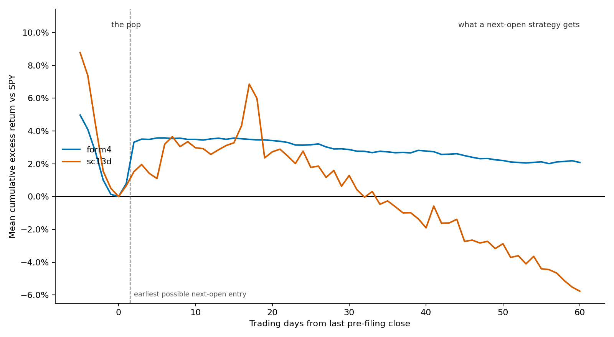
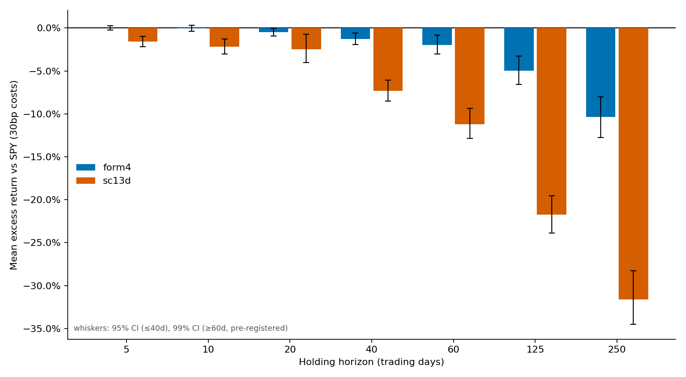

# I pre-registered my trading strategy's kill criteria. An AI pulled the trigger — twice.

*The anatomy of a dead edge: insider clusters and 13D filings, 2021–2026.*

I have built five trading bots over the last several years. All five are dead. The first three died the ordinary way — quietly, after I lost interest or lost confidence, with no clean moment of death I could point to.

The last two died differently. They were killed by criteria I wrote down and froze in a config file before I had seen any of the data, and the trigger was pulled by an AI agent I directed and had agreed in advance not to second-guess. When the numbers came back failing, there was no argument to have. The spec already said what failing meant.

The full, definitive answer — does following insider cluster buys and 13D filings beat the market net of costs — cost about $100 in data fees and roughly three days of work. This is the write-up of how I got there, what the data actually said, and what I learned from losing the argument to it.

## The four that came before

The predecessors are worth one sentence each, because they are the reason attempt #5 looks the way it does.

The first was a Kalshi bot that predicted 15-minute crypto direction; archived after ~16,700 paper trades at a 67.8% win rate and −$94.50 — the win rate was real, the edge wasn't. The second was a delta-neutral funding-carry design that killed itself in its own backtest at ~3.1% return on capital, below T-bills, before it ever traded. The third was an options bot built on technical-analysis signals that I never validated at all. The fourth was an SEC-filing alert tool that produced signals and nothing else — no position, no P&L, no verdict.

The Kalshi bot is the one that haunts the design. Its model reported a **0.917 validation AUC and still lost money in practice** — a textbook train/serve skew, where the model scoring signals in the backtest was not the same object scoring them when it mattered. A great-looking validation number is worthless if the thing you validated isn't the thing you ran.

So attempt #5 was designed around pre-commitment from the first line. The spec came first. The go/kill gate thresholds were frozen in `config.yaml` before any data was pulled. And the signal logic was made one module — a single scorer imported byte-identically by the backtester and by any future live system — so that the specific failure that sank the Kalshi bot, research drifting from production, became structurally impossible rather than something I had to remember to check.

## The build

The division of labor was explicit. I owned the strategy, the gate thresholds, the judgment calls, and the decision to accept the verdict. The AI agent owned the implementation: roughly 4,300 lines of code and about 100 tests, written test-first, with a two-stage review after every task — one pass against the plan, one pass for correctness.

That review process is the part that makes the discipline credible, so here are the five bugs it caught, one each. (1) Joint Form 4 filings were fanning out, so a single $30M purchase co-signed by five affiliated entities looked like a five-insider cluster at five times the dollar value. (2) NaN and inf price strings were slipping past a `<= 0` guard and would have silently poisoned cluster totals. (3) A blank CENTRAL INDEX KEY line made the EDGAR header parser swallow the following line as the CIK. (4) Multi-listing companies were resolving to their warrant ticker instead of common stock, quietly tanking price coverage. (5) The portfolio simulator was settling positions cost-free, softening two of the five gate checks without saying so.

None of these would have thrown an error. Each one would have made the result look slightly better or slightly different than the truth, which is exactly the kind of bug that survives all the way into a live account.

## The verdict: KILL, both profiles

The gate frozen in `config.yaml` requires, among other checks, a 95% bootstrap CI lower bound above zero on mean per-event excess return vs SPY after costs, a positive-years count, and a drawdown bound. Run once against 2021–2026 at the headline 30bp round-trip cost, both profiles failed at every horizon.

Form 4 cluster buys — KILL. Coverage 88.7%.

| Horizon | N | Mean excess | 95% CI | Pos. years | Port. excess (ann.) | Max DD | Pass |
|---|---|---|---|---|---|---|---|
| 5 | 4651 | +0.0004 | [-0.0021, +0.0029] | 3 | -14.95% | 49.88% | ❌ |
| 10 | 4651 | -0.0003 | [-0.0038, +0.0032] | 2 | -2.57% | 48.56% | ❌ |
| 20 | 4651 | -0.0050 | [-0.0094, -0.0005] | 1 | -27.46% | 56.88% | ❌ |
| 40 | 4651 | -0.0127 | [-0.0194, -0.0059] | 2 | -17.74% | 54.51% | ❌ |

13D initiations — KILL. Coverage 92.3%.

| Horizon | N | Mean excess | 95% CI | Pos. years | Port. excess (ann.) | Max DD | Pass |
|---|---|---|---|---|---|---|---|
| 5 | 2976 | -0.0160 | [-0.0218, -0.0098] | 1 | -28.82% | 77.02% | ❌ |
| 10 | 2976 | -0.0217 | [-0.0302, -0.0129] | 1 | +0.99% | 52.52% | ❌ |
| 20 | 2976 | -0.0248 | [-0.0405, -0.0074] | 1 | +36.53% | 25.89% | ❌ |
| 40 | 2976 | -0.0731 | [-0.0853, -0.0609] | 0 | -21.73% | 57.31% | ❌ |

The gate spoke. Per the spec, no live system was built.

## The autopsy

A KILL verdict is not the interesting part. The interesting part is *why*, and the why is not "no signal here." There is a signal. It just isn't reachable from where this system stands.

*Mean cumulative excess return vs SPY in event time, anchored at each signal's last close strictly before its filing date (offset 0). Each point averages all signals whose price history reaches that offset; the sample changes with offset — n moves from 5,739 (offset 0) to 5,701 (offset 60) for form4 and stays 4,641 for sc13d — so later points reflect a slightly different subset, not one cohort tracked through time. This is an illustrative cross-sectional average, not a per-position return path and not a tradeable backtest; for fixed-horizon per-event statistics see the horizon figure and the committed reports. No forward-fill. Generated by `scripts/article_figures.py`.*

Read the figure left to right. Before day 0, prices fall into both filing types. Insiders and 13D filers are buying declines — they are catching their own falling knives, accumulating at prices a follower watching the public filing never gets to see.

Then the pop. Between the last pre-filing close and the next open, the SPY-adjusted move is **+2.86% [CI +2.69%, +3.04%] for Form 4 clusters and +1.67% [+1.15%, +2.32%] for 13D initiations** — and that entire move is consumed before the earliest moment a next-open entrant could be filled, marked by the dashed line. The edge is real and it is sitting on the wrong side of the line.

After the line, there is almost nothing left to take. Form 4 drifts from roughly +3.5% down to about +2.1% by day 60; a next-open entrant captures approximately none of it, and is slightly negative after costs. The 13D curve shows an unexplained local spike around day 17 (a feature I did not investigate) and then decays relentlessly to about −5.8% by day 60. Following 13D filers at this latency was not flat — it was actively costly.

Swapping the benchmark does not rescue either one. Against IWM, a small/mid-cap proxy, Form 4 averages about −0.11% excess across horizons and 13D about −2.59%. Benchmark-shopping doesn't change the answer.

One honest accounting note: the day-60 values on this curve will not tie out arithmetically to the per-event horizon stats in the tables above, and they are not supposed to. The curve is a close-anchored cross-sectional mean that *includes* the pre-entry pop; the horizon stats measure entry-open to exit-open per event. They are different measurements of different things.

This is also one market regime. The window is 2021 through 2026, an era led by mega-cap names, structurally hostile to the small-cap tilt these signals carry. I am not claiming no edge exists anywhere. I am claiming that in this data, at this latency, with this entry rule, the edge was gone before this system could touch it. The bootstrap CIs assume IID per-event returns and overlapping holding windows violate that, so the true intervals are wider than printed; the committed reports spell this out.

## Study 2: the longer horizon, a stricter bar

There is a fair objection to all of the above: the academic literature on filing-following doesn't claim a 5-to-40-trading-day edge. It claims a 6-to-12-month one. So before closing the book, I tested the claim on its own terms.

This got its own pre-registered spec (commit `0faa4ac`), and a deliberately harder bar than Phase 0: a 99% bootstrap CI instead of 95%, plus economic-significance floors the mean had to clear — at least +1% at 60 days, +2% at 125, +3% at 250 — all committed before a single Study 2 return was computed.

Form 4 — NO-SIGNAL. Coverage 88.7%.

| Horizon | n | mean excess | 99% CI | floor | floor met | pos. years | IWM mean |
|---|---|---|---|---|---|---|---|
| 60 | 4601 | -1.97% | [-3.03%, -0.85%] | +1.0% | no | 2/6 | -1.09% |
| 125 | 4278 | -4.97% | [-6.58%, -3.27%] | +2.0% | no | 1/5 | -2.53% |
| 250 | 3772 | -10.34% | [-12.74%, -8.00%] | +3.0% | no | 1/5 | -4.00% |

13D — NO-SIGNAL. Coverage 92.3%.

| Horizon | n | mean excess | 99% CI | floor | floor met | pos. years | IWM mean |
|---|---|---|---|---|---|---|---|
| 60 | 2976 | -11.19% | [-12.85%, -9.38%] | +1.0% | no | 0/4 | -8.57% |
| 125 | 2976 | -21.75% | [-23.90%, -19.55%] | +2.0% | no | 0/4 | -16.39% |
| 250 | 2976 | -31.60% | [-34.49%, -28.29%] | +3.0% | no | 0/4 | -22.79% |

The longer horizon did not redeem the signal — it indicted it. At every long horizon, in this window, these filings were a *contrarian* indicator. **13D targets returned −31.6% excess vs SPY at 250 days, and even against the small-cap index that is generous, at −22.8% vs IWM.** Following the literature's own preferred horizon made the result worse, not better. Same one-regime caveat applies; same wider-than-printed CI caveat applies.

## What I learned

**Real edges are consumed at machine latency.** The +2.9% was there in the data, unambiguously — and it was gone before any daily-bar, next-open system could reach it. Capturing it would require same-day intraday entry, which this system deliberately never attempted. The lesson isn't that the anomaly is fake; it's that "an edge exists" and "an edge I can reach" are different claims, and only the second one pays.

Negative results compound. Each of these studies didn't kill a parameter setting — it killed a strategy *family*, and its manual-trading variant along with it. Form 4 following and 13D following are off the table for me now, both as automated systems and as a source of discretionary ideas, because the same data that fails the bot fails the human reading the same filings.

Pre-registration is the only real defense against yourself. By the third test, the pull to "just try one more configuration" is enormous — a different horizon, a different cost assumption, a benchmark that flatters. The frozen criteria are the thing that says no. A gate written after you've seen the results isn't a gate, it's a rationalization with a timestamp.

And the meta-lesson: directing an AI through disciplined research is a genuinely different skill from asking one to build you a trading bot. The agent supplied implementation speed and caught its own plan's bugs in a review it ran on itself. I supplied the questions, the gates, and — the part that actually mattered — the willingness to lose the argument with the data when it came back saying no.

## Coda

All of this is reproducible. The repository is at https://github.com/Franzi317/DriftHunter; the [runbook](phase0-runbook.md) records the Phase 0 run end to end. Both pre-registration points are in the history: the frozen `gate:` block in `config.yaml`, and commit `0faa4ac` for the Study 2 spec, each committed before the data they govern was computed. The suite is 125 passing tests, network-free (`uv run pytest tests/ -q`).

The $5k is in T-bills.
